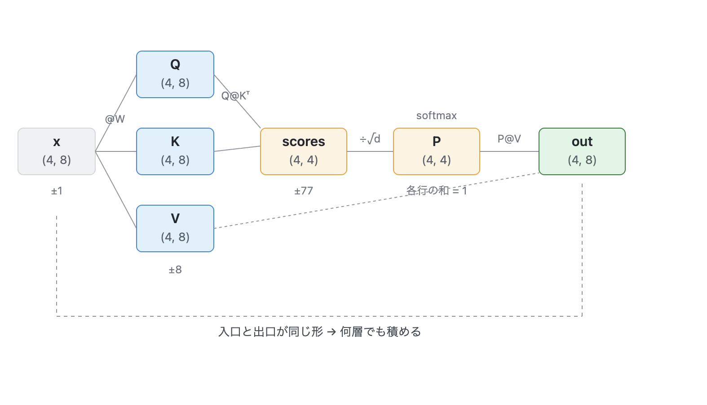
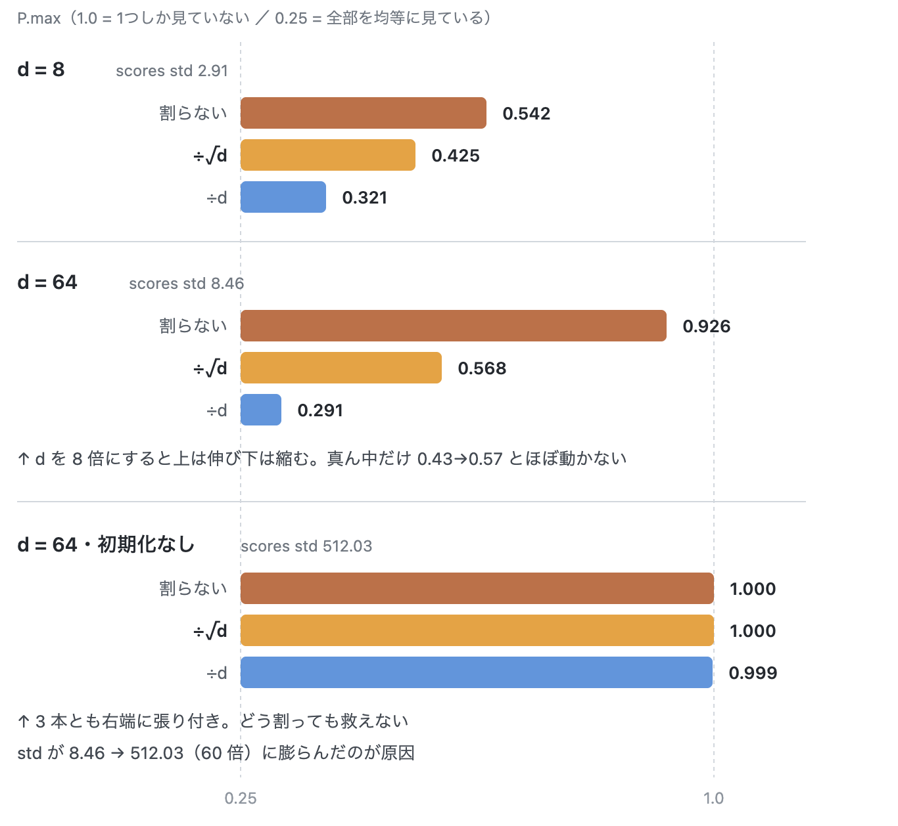
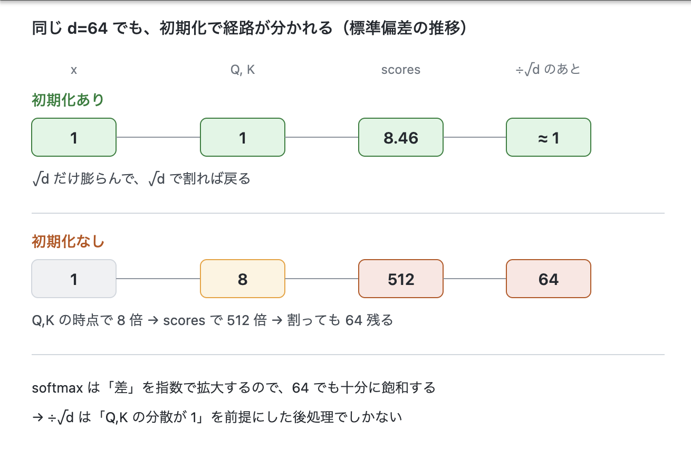

# W1: Attention を手で書く
```bash
uv run python all_src/W1.py
```

---

## やったこと

4トークン × 次元 d の入力から `Q, K, V` を作り、`Q @ K.T` で 4×4 のスコア行列を得て、softmax したあと `V` と掛ける。フレームワークは使わず numpy のみ。



真ん中の `(4, 4)` が「4トークン × 4トークンの相性表」で、Attention の本体はここだけ。前後の `(4, 8)` は入口と出口で、**形が一致している**ため出力をそのまま次の層に渡せる。

検証したのは以下の3点。

- softmax 後の各行の合計が 1 になるか
- `scores` を `raw / √d / d` の3通りで割ったとき、分布の尖り方がどう変わるか
- 次元 `d` を 8 → 64 に変えたとき、その傾向が保たれるか

尖り具合の指標には `P.max(axis=-1).mean()` を使った。4トークンなので、1.0 なら1つだけを見ている状態、0.25 なら全部を均等に見ている状態。

---

## 結果

```
--- d=8, scale=True ---
  scores std: 2.91
  raw        P.max=0.5420  sum=[1. 1. 1. 1.]
  /sqrt(d)   P.max=0.4250  sum=[1. 1. 1. 1.]
  /d         P.max=0.3213  sum=[1. 1. 1. 1.]
--- d=64, scale=True ---
  scores std: 8.46
  raw        P.max=0.9258  sum=[1. 1. 1. 1.]
  /sqrt(d)   P.max=0.5684  sum=[1. 1. 1. 1.]
  /d         P.max=0.2914  sum=[1. 1. 1. 1.]
--- d=64, scale=False ---
  scores std: 512.03
  raw        P.max=1.0000  sum=[1. 1. 1. 1.]
  /sqrt(d)   P.max=1.0000  sum=[1. 1. 1. 1.]
  /d         P.max=0.9991  sum=[1. 1. 1. 1.]
```



### 各行の合計は常に 1

全9パターンで `sum=[1. 1. 1. 1.]`。分布が飽和していようと潰れていようと、softmax は必ず 100% を配り切る。チェック項目クリア。

### `√d` だけが次元に振り回されない

| | d=8 | d=64 | 変化 |
|---|---|---|---|
| 割らない | 0.542 | 0.926 | 尖っていく |
| **÷√d** | **0.425** | **0.568** | **ほぼ不変** |
| ÷d | 0.321 | 0.291 | 潰れていく |

割らなければ次元を上げるほど one-hot に近づき、`d` で割れば逆に一様分布（0.25）へ潰れる。**どちらもモデルサイズを変えると性格が変わってしまう。**

つまり `√d` は「ちょうどいい値だから」選ばれているのではなく、**`d` を変えても分布の尖り具合が保たれる唯一のスケール**だから選ばれている。

---

## ハマった点: 割り算だけでは救えない

d=64 で試したとき、`√d` で割っても `P.max = 0.9999` になり予想が外れた。原因は `scores` の除算ではなく **`W` の初期化スケール**だった。

`W = rng.normal(size=(d, d))` のまま使うと `Q, K` の各要素の標準偏差が `√d = 8` になる。その内積を取ると `scores` の標準偏差は `d^1.5 = 512`。これを 8 で割ってもまだ 64 残るので、softmax にとっては十分に飽和する。



`W` を `1/√d` でスケールすると `scores std` が **512.03 → 8.46**（理論値 512 と 8 にほぼ一致）に収まり、理論通りの結果が出た。

初期化を外した状態では **3通りとも `P.max ≈ 1.0`**。`√d` で割っても、`d` で割ってさえ 0.9991。割り方の選択そのものが無意味になる。

> **`√d` 除算は「Q・K の要素分散が 1」という前提の上に成り立つ後処理でしかない。**
> 前提を保証しているのは初期化のほうで、前提が崩れればどう割っても救えない。

教科書には「`√d` で割る」としか書かれておらず、前提のほうは書かれない。実装して初めてぶつかった。

---

## 導出メモ

各成分が独立に平均 0・分散 1 の `d` 次元ベクトル `q, k` について、

```
Var(q·k) = Σ Var(q_i k_i) = d      →  標準偏差 = √d
```

なので `√d` で割ると分散が 1 に戻る。`d` で割ると `1/d` になり割りすぎ。

softmax の上位2つの比は `P1/P2 = exp(z1 - z2)` で、**差だけで決まり指数で効く**。今回 `scores` に `43.34` と `-77.47` が現れた行では差が約 120 あり、`exp(120) ≈ 10^52`。倍精度の有効桁を超えるため、小さいほうは完全に 0 になる。

初期化なしの場合は `Q, K` の分散が `d` なので、内積の分散は `d^3`、標準偏差 `d^1.5`。d=64 で 512。

---

## 学んだことの整理

1. **表面**: `scores` を `√d` で割ると softmax の尖りが抑えられる
2. **その下**: `√d` は内積の標準偏差そのもの。だから `d` に依存しない唯一のスケールになる
3. **さらに下**: この処方箋は初期化が分散 1 を保っていることが前提。前提が崩れれば無効

3 は予想を外して原因を追わないと出てこなかった。

---

## W3 への申し送り

`init_weights(..., scale=False)` で今回の壊れた状態をいつでも再現できるようにしてある。

| 症状 | 原因候補 | 確認方法 |
|---|---|---|
| softmax が one-hot に張り付く<br>（学習時は損失が下がらない） | (a) `√d` 除算の忘れ<br>(b) 初期化スケール過大 | `P.max(axis=-1).mean()` が 1 に近いか<br>`scores.std()` が `√d` 程度に収まっているか |

softmax のヤコビアン対角成分は `P_i(1 - P_i)` なので、`P_i` が 0/1 に近づくと勾配が消える。今週は順伝播だけなので「尖っている」で済んでいるが、W2 で学習を入れると損失が下がらない症状として現れるはず。

---

## 残課題

- [ ] バッチ次元 `(B, T, d)` への拡張 → W2
- [ ] causal mask（`scores` に `-inf`）→ W2
- [ ] multi-head 化（`d_model` と `d_head` の分離）→ W2
- [ ] 逆伝播 → W2
- [ ] `init_weights` の引数名を `scale` → `init_scale` に変更（`attention` の `div` と紛らわしい）

---

###参考文献
・scaled dot-product attention の順伝播
https://zenn.dev/yuto_mo/articles/72c07b702c50df